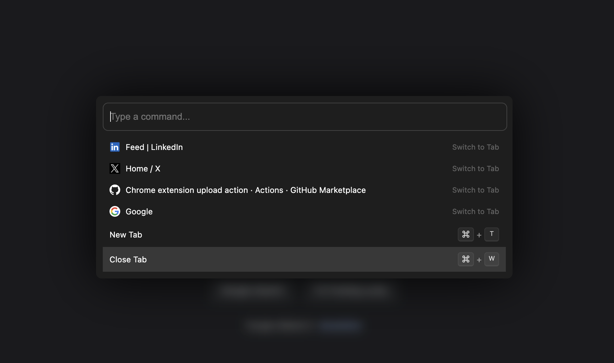

 # Command Palette for Browsers

[](https://chrome.google.com/webstore)

[](https://microsoftedge.microsoft.com/addons)

[](https://chrome.google.com/webstore)

A command palette for browsers that provides quick access to tabs, bookmarks, and browser actions through a keyboard-driven interface.



## Features

- 🚀 Quick tab switching
- ⌨️ Keyboard-first navigation
- 🔍 Fuzzy search for tabs and commands
- 📖 Browser history integration
- 🎯 Most visited sites suggestions
- ⚡ Fast and lightweight

## Installation

### From Source
1. Clone this repository:
```bash
git clone https://github.com/yourusername/browser-command-palette.git
```

2. Open Chrome/Brave/Edge and navigate to:
   - Chrome: `chrome://extensions`
   - Brave: `brave://extensions`
   - Edge: `edge://extensions`

3. Enable "Developer mode" in the top right corner

4. Click "Load unpacked" and select the cloned repository folder

### From Web Store
*(Coming soon)*

## Usage

1. Press `Cmd+K` (Mac) or `Ctrl+K` (Windows/Linux) to open the command palette
2. Type to search for:
   - Open tabs
   - Browser commands
   - Recently visited sites
   - Most frequently visited sites
3. Use arrow keys to navigate and Enter to select
4. Press Tab to autocomplete suggestions

## Browser Support

- ✓ Google Chrome (Latest)
- ✓ Microsoft Edge (Latest)
- ✓ Brave Browser (Latest)